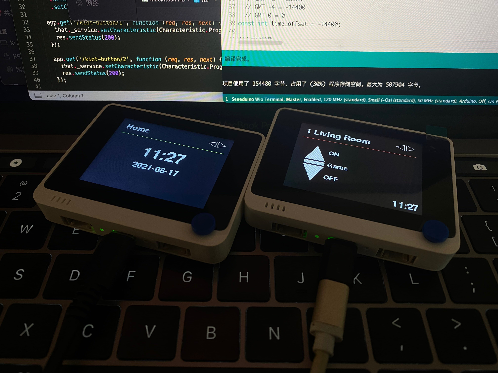
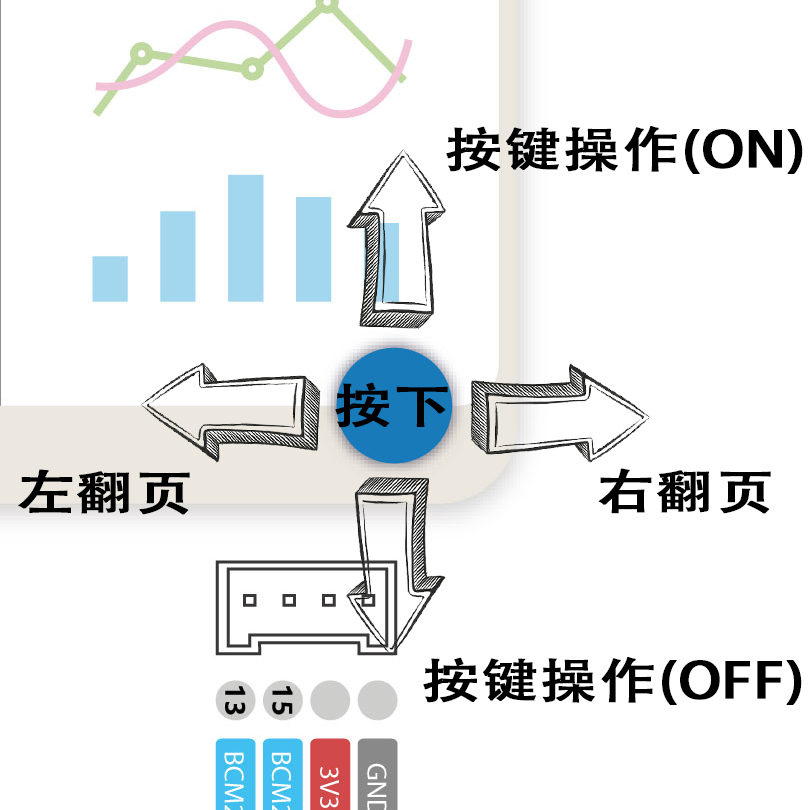
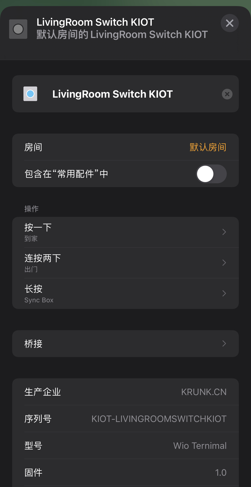
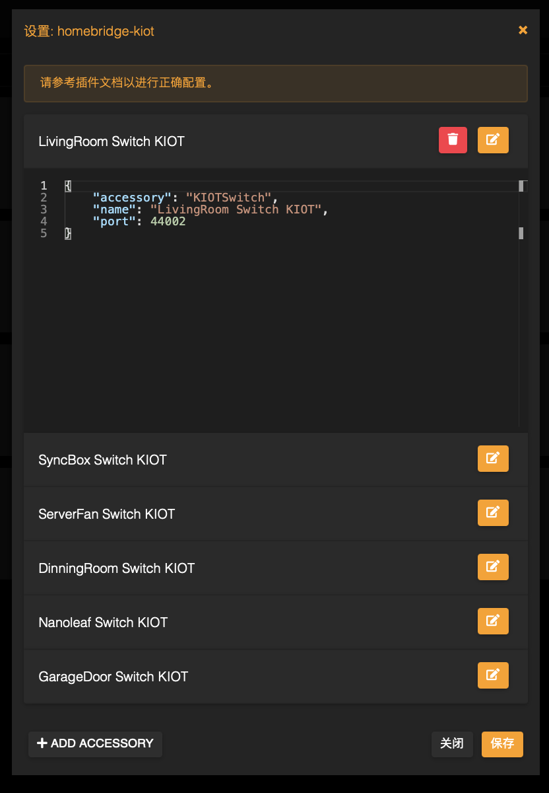
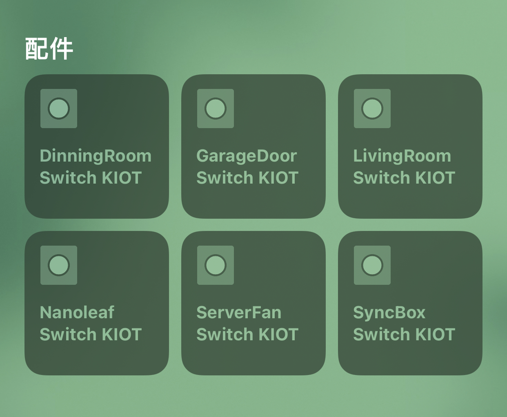

# Wio Terminal 控制多个 HomeKit 设备

闲来无事，想接触下Arduino开发，于是刚巧不巧看到了亚马逊 Wio Terminal 在打折就入手了两个，想着可以给自己的家庭添加两个控制器，因为设备繁多所以也不太方便用 HomeKit 按键来实现，也不太喜欢走到哪里都用手机控制，于是乎就做了这么个项目。

官方开发文档: https://wiki.seeedstudio.com/Wio-Terminal-Getting-Started/

<p align="center"></p>

RTL8720DN 貌似不能直接使用网上有的 HomeSpan 这类直接集成原生 Homekit，也刚好我的米家，TP 这类设备使用了 HomeBridge 来桥接，所以最后决定用 HomeBridge 来桥接这台小屏幕。


### 先来看看效果：

<p align="center"></p>

自己画了个主屏幕以及菜单，还加入了 NTP 时间，放在桌上又实用又好看，朋友来自己家还能说这个是自己做的。

## 目前的功能：

1. 支持多个页面，每页模拟一个 HomeKit Button 最多可以执行三个操作
2. 时间显示，连接网络时会自动更新
3. 超时自动熄灭屏幕
4. 抬手亮屏，不用手动点击锁屏键
5. 方便的自定义菜单 - 通过Array自定义菜单页面
6. HomeBridge 插件 - 定义按钮端口以及名称


## 安装注意事项

ino 文件在 Wio/KIOT-Project/KIOT-Project.ino，使用Arduino打开

库文件在 Wio/libraries 复制到 Arduino 库文件夹中

HB 插件为 homebridge-kiot 文件夹

## 网络参数配置

```
// WiFi SSID (部分5Ghz AP可能无法连接)
const char* ssid = "KIOT-Terminal";

// WiFi 密码
const char* password = "KIOT-UYDFGW6IdaW";

// HomeBridge地址 不要后斜杠以及ssl
// 如需使用ssl还需要配置公钥
const char* server_ip = "http://10.0.0.86";
```

## HomeKit 按钮


<p align="center"></p>

三个功能在每页中分别对应 Wio Ternimal 的操作

按一下 - 向上拨

按两下 - 向下拨

长按 - 按下

<p align="center"></p>

## 时间显示

通过 NTPClient (https://github.com/taranais/NTPClient/) 实现联网同步，默认通过 pool.ntp.org 来更新

感谢这篇简单的教程: https://randomnerdtutorials.com/esp32-ntp-client-date-time-arduino-ide/

需要自行定义时区

```
// 时区offset定义
  // GMT +1 = 3600
  // GMT +8 = 28800
  // GMT -4 = -14400
  // GMT 0 = 0
const int time_offset = 28800;
```
## 自动熄屏以及抬手亮屏

通过参数定义一个超时时间，会在没有操作到达时间后自动熄灭

IMU会检测是否有移动，如果监测到移动就会亮屏 (手动关闭屏幕5秒内会暂时禁用)


## 自定义菜单

```
const String menu_config[7][6] = 
{ { "0", "0", "Home" },  //定义首页标题
{ "1", "44002", "Living Room", "ON", "Game", "OFF" }, 
{ "2", "44003", "Sync Box", "Start", "", "End" },
{ "3", "44004", "Server Fan", "ON", "", "OFF" },
{ "4", "44005", "Dinning Room", "ON", "", "OFF" },
{ "5", "44006", "Nanoleaf", "ON", "Pink", "OFF" },
{ "6", "44007", "Garage Door", "Open", "", "Close" }
};
```

```
menu_config[修改为页面总数][6]
```

```
{ "编号", "HB端口号", "菜单标题", "向上拨提示文字", "按下提示文字", "向下拨提示文字" }
```

## HomeBridge 插件

HomeBridge 自身的配置很简单，我是用 Docker 安装在了群晖上，可以访问官网就能找到安装方法

由于对插件的不熟悉，目前对我来说只能做出来一个端口对应一个 Button，但是无妨，也用不了多少个，我的插件是基于 HomeBridge-Dummy 进行的修改，所以比较简单 (如果有大佬会写Platform，那就可以避免这个问题了)

## HB 插件安装方法

将 homebridge-kiot 文件夹复制到配置文件目录下

在 HomeBridge 图形界面右上角打开终端输入

```
npm install /路径/homebridge-kiot
```

输入完成后就会显示在插件tab中

### 单个Button的配置文件

```
{
    "accessory": "KIOTSwitch", // 插件名 不可修改
    "name": "LivingRoom Switch KIOT", // 按钮名称
    "port": 44002 // 端口号 注意不要与其他端口冲突
}
```

<p align="center"></p>


### 完整配置json文件 (完整的Homebridge配置文件例子，经供参考)

```
{
    "bridge": {
        "name": "HomeBridge",
        "username": "0A:81:3D:E3:84:2B",
        "port": 53780,
        "pin": "031-45-868"
    },
    "platforms": [
        {
            "name": "Config",
            "port": 8581,
            "auth": "form",
            "theme": "auto",
            "tempUnits": "c",
            "lang": "zh-CN",
            "platform": "config"
        }
    ],
    "disabledPlugins": [],
    "accessories": [
        {
            "accessory": "KIOTSwitch",
            "name": "LivingRoom Switch KIOT",
            "port": 44002
        },
        {
            "accessory": "KIOTSwitch",
            "name": "SyncBox Switch KIOT",
            "port": 44003
        },
        {
            "accessory": "KIOTSwitch",
            "name": "ServerFan Switch KIOT",
            "port": 44004
        },
        {
            "accessory": "KIOTSwitch",
            "name": "DinningRoom Switch KIOT",
            "port": 44005
        },
        {
            "accessory": "KIOTSwitch",
            "name": "Nanoleaf Switch KIOT",
            "port": 44006
        },
        {
            "accessory": "KIOTSwitch",
            "name": "GarageDoor Switch KIOT",
            "port": 44007
        }
    ]
}
```

配置完成并重启后会在家庭App中显示这几个按键

<p align="center"></p>

启动 Wio Terminal 应该就能操控这几个按键了

访问我的博客来讨论！https://krunk.cn/kblog2174.html

